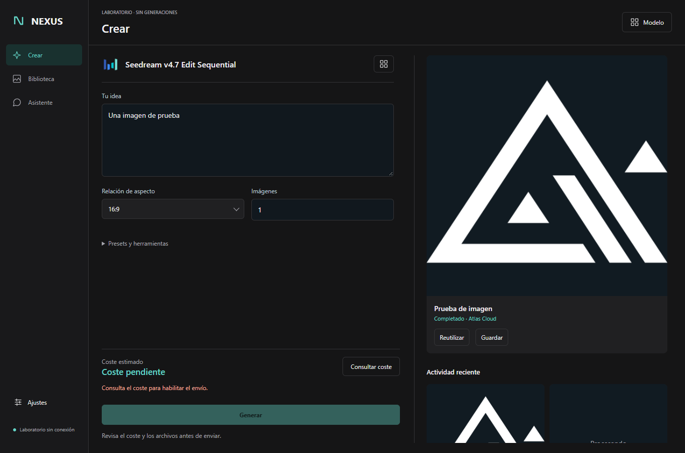

# Mis proyectos

Estas son las aplicaciones en las que concentro el trabajo de Android, multimedia y agentes. Algunas funciones siguen en desarrollo; los resultados comprobados están en [Pruebas y pendientes](VALIDATION.md).

## AXEL

Quería trabajar con agentes desde el teléfono y darles acceso al entorno local. AXEL reúne la conversación con Codex CLI, Grok y Antigravity/AGY, los adjuntos y las herramientas de archivos y Android.

La app se conecta a puentes de Termux que gestionan streaming, cancelación y trabajos. Las rutas multimedia incluyen OCR, transcripción y referencias para los proveedores configurados. Native, la edición WebView y AXEL AI con servidor tienen implementaciones distintas.

Todavía estoy reconciliando algunas rutas del código con los servicios activos. [Estado de las pruebas](VALIDATION.md#axel).

## AXEL Editor de vídeo

Editor Android con varias pistas, clips de vídeo y audio vinculados, timeline, deshacer y autoguardado. El modelo temporal está separado de la interfaz, y la previsualización comparte el grafo Media3 con la exportación.

En el Pixel comprobé importación, exportación H.264 a 720p y duplicación con deshacer de clips vinculados. El proyecto también incluye keyframes, color, LUT y rótulos; las funciones avanzadas necesitan más desarrollo y pruebas.

Antes se llamaba Corte. El nuevo nombre ya está en las fuentes, pero falta la actualización del APK instalado. [Resultados de exportación](VALIDATION.md#axel-editor-de-vídeo).

## ALEXIA

Biblioteca de imágenes, vídeos y audio organizada por proyectos. El catálogo usa Room y se conecta a los archivos mediante SAF. DocumentsProvider permite abrir los medios desde el selector de otras aplicaciones.

Aquí el trabajo está en mantener el índice y los archivos coherentes, conservar referencias y recuperar escrituras interrumpidas. Las pruebas de importación e integridad están documentadas por versión. [Estado de ALEXIA](VALIDATION.md#alexia).

## NEXUS

Reúne modelos de imagen, vídeo y audio, sus opciones y los resultados. El flujo va desde elegir modelo y referencias hasta seguir el trabajo y guardar lo generado. Tiene aplicación Android y escritorio.

*Interfaz real con datos de prueba.*

Los formularios se adaptan a cada modelo. La conexión a los proveedores y las generaciones necesitan su configuración; el catálogo local puede consultarse aunque se esté recuperando la conexión. [Pruebas de NEXUS](VALIDATION.md#nexus).

## NutriShift

Planifica las comidas según los turnos y lo que hay en casa. Conecta menú, recetas, raciones, despensa y compra, y permite cambiar una propuesta o fijar un objetivo manual.

Se han comprobado el menú semanal, el avance al marcar una comida, el alta de un producto y el objetivo manual visible. Quedan las pruebas actuales de consumo reversible y calendario. [Pruebas de NutriShift](VALIDATION.md#nutrishift).

## AudioTrim

Abres un archivo, eliges un tramo y guardas el recorte. El motor trata WAV, MP3 y AAC por rutas distintas.

En WAV, los recortes recuperados conservan exactamente las muestras seleccionadas, también con un chunk adicional en el archivo. Los otros formatos siguen pendientes de repetir. [Resultados de AudioTrim](VALIDATION.md#audiotrim).

[Más aplicaciones](CATALOG.md) · [Estado de todas las entradas revisadas](REVIEW.md)

Mantengo privadas las fuentes de la mayoría de estos proyectos. Tienen código público [AXEL Editor de vídeo](https://github.com/egodivergente/corte), [NutriShift](https://github.com/egodivergente/nutrishift) y [CineVault 48](https://github.com/egodivergente/CineVault48).
